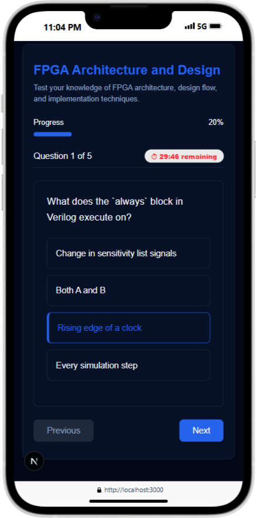

# Project Name: **Chip Sphere**

This project visualizes and analyzes various chip data metrics through interactive dashboards. It fetches data from a backend API and displays it using charts and key insights, enabling users to easily track and interpret chip-level statistics.

## 🔗 Live Demo

[Click here to view the live project](https://chip-sphere.vercel.app/)

---

## Table of Contents

1. [Project Setup](#project-setup)  
2. [Frontend Installation](#frontend-installation)  
3. [Backend Installation](#backend-installation)  
4. [Running the Project](#running-the-project)  
5. [Technologies Used](#technologies-used)  
6. [Device Screenshots](#device-screenshots)

---

## Project Setup

Before you begin, ensure you have the following installed for both the **frontend** and **backend**:

- **Node.js**: [Download Node.js](https://nodejs.org/)  
- **npm** (comes with Node.js): For managing dependencies.  
- **MongoDB** (for database)

---

## Frontend Installation

1. **Clone the repository:**

    ```bash
    git clone https://github.com/sanketyelugotla/Chip-Sphere.git
    cd Frontend
    ```

2. **Install dependencies:**

    ```bash
    npm install
    ```

3. **Start the development server:**

    ```bash
    npm run dev
    ```

4. Open the app in your browser at [http://localhost:5173](http://localhost:5173)

    - The project should automatically open in your default browser.  
    - If not, open [http://localhost:5173](http://localhost:5173) manually.

---

## Backend Installation

1. **Navigate to the backend folder:**

    ```bash
    cd ../Backend
    ```

2. **Install dependencies:**

    ```bash
    npm install
    ```

3. **Set up the database:**

    - Make sure MongoDB is running locally or use [MongoDB Atlas](https://www.mongodb.com/cloud/atlas)
    - Confirm the connection string is set correctly.

4. **Create a `.env` file:**

    ```env
    MONGO_URL=<your-mongodb-connection-string>
    PORT=5000
    ```

    - Replace `<your-mongodb-connection-string>` with your actual MongoDB URI.

5. **Start the backend server:**

    ```bash
    npm run dev
    ```

    This starts the server at [http://localhost:5000](http://localhost:5000)

---

## Project Structure    

```bash
Chip-Sphere/
├── backend/
│ ├── .env
│ ├── .gitignore
│ ├── index.js
│ ├── config/
│ │ └── db.js
│ ├── middleware/
│ │ ├── authenticate.js
│ │ └── authenticateAdmin.js
│ ├── models/
│ │ ├── Blog.js
│ │ ├── Download.js
│ │ ├── Project.js
│ │ ├── Question.js
│ │ ├── QuizAttempt.js
│ │ ├── Quizz.js
│ │ ├── Resource.js
│ │ └── User.js
│ ├── routes/
│ │ ├── auth.route.js
│ │ ├── blog.route.js
│ │ ├── index.js
│ │ ├── project.route.js
│ │ ├── question.route.js
│ │ ├── quiz.route.js
│ │ ├── resources.route.js
│ │ └── user.route.js
│ ├── seed/
│ │ ├── project.json
│ │ ├── seedBlogs.js
│ │ ├── seedProjects.js
│ │ └── seedQuestions.js
│ ├── services/
│ │ ├── auth.service.js
│ │ ├── blog.service.js
│ │ ├── index.js
│ │ ├── project.service.js
│ │ ├── question.service.js
│ │ ├── quiz.service.js
│ │ ├── resources.service.js
│ │ └── user.service.js
│ ├── package.json
│ └── package-lock.json
│
├── frontend/
│ ├── .env
│ ├── .gitignore
│ ├── app/
│ │ ├── layout.jsx, page.jsx, loading.jsx
│ │ ├── about/page.jsx
│ │ ├── auth/SignupForm.jsx, LoginForm.jsx, page.jsx
│ │ ├── blogs/[id]/page.jsx, loading.jsx, page.jsx
│ │ ├── profile/[id]/page.jsx, Loading.jsx
│ │ ├── projects/[id]/page.jsx, page.jsx
│ │ ├── quizzes/[id]/page.jsx, loading.jsx
│ │ ├── quizzes/submit/[id]/page.jsx
│ │ └── resources/page.jsx
│ ├── components/
│ │ ├── blogCard.jsx, FeaturedBlogCard.jsx, Footer.jsx, Navbar.jsx
│ │ ├── ProjectCard.jsx, QuizCard.jsx, ResourceCard.jsx
│ │ ├── theme-toggle.jsx, ToastWithTheme.jsx
│ │ └── ui/alert.jsx, button.jsx, card.jsx, dropdown-menu.jsx, input.jsx, label.jsx, sheet.jsx, tab.jsx, use-toast.js
│ ├── context/userContext.jsx
│ ├── hooks/HoverDiv/
│ │ ├── HoverDiv.css, HoverDiv.jsx, HoverMainDiv.jsx
│ │ ├── LeftDiv.jsx, Mini.jsx, RightDiv.jsx
│ │ └── index.js, Index.jsx
│ ├── lib/utils.js
│ ├── public/
│ │ ├── .well-known/appspecific/com.chrome.devtools.json
│ │ ├── all logo, icon, and image files (.svg, .png, .jpg)
│ ├── styles/globals.css
│ ├── services/
│ │ ├── auth.js, blog.js, projects.js, quizz.js, resources.js, user.js
│ ├── jsconfig.json
│ ├── next.config.mjs
│ ├── tailwind.config.js
│ ├── postcss.config.mjs
│ ├── eslint.config.mjs
│ ├── package.json
│ └── package-lock.json
│
├── screenshots/
│ ├── mobile_1.png, mobile_2.png, mobile_3.png, mobile_4.png
│ ├── laptop_1.png, laptop_2.png, laptop_3.png, laptop_4.png
│ ├── tablet_1.png, tablet_2.png, tablet_3.png, tablet_4.png
│
├── README.md (this file)
```

## Running the Project

Once both the **frontend** and **backend** are up:

- Frontend: [http://localhost:5173](http://localhost:5173)  
- Backend: [http://localhost:5000](http://localhost:5000)

The frontend communicates with the backend to fetch and visualize chip metrics.

---

## Technologies Used

### Frontend

- **Next.js**: React framework for server-side rendering and static site generation  
- **Tailwind CSS / Material UI**: For responsive UI components  
- **Axios**: To handle HTTP requests  

### Backend

- **Node.js**: Runtime environment  
- **Express.js**: Backend routing and middleware  
- **MongoDB / Mongoose**: NoSQL database   

---

## Device Screenshots

### Mobile Phones

|  |  |  |  |
| -------------------------------------- | -------------------------------------- | -------------------------------------- | -------------------------------------- |

### Laptops

|  |  |  |  |
| -------------------------------------- | -------------------------------------- | -------------------------------------- | -------------------------------------- |

### Tablets

|  |  |  |  |
| -------------------------------------- | -------------------------------------- | -------------------------------------- | -------------------------------------- |

