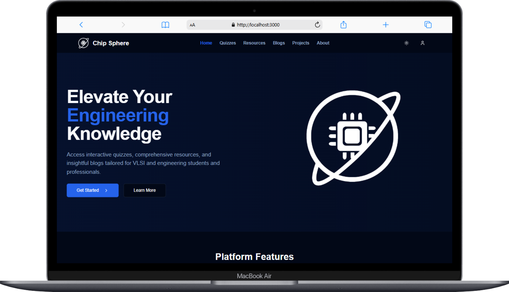
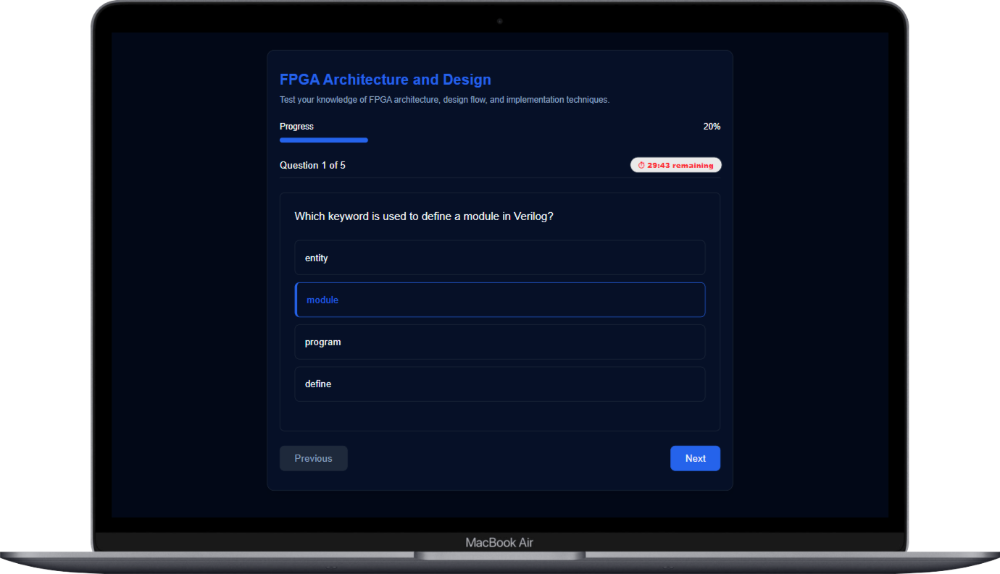
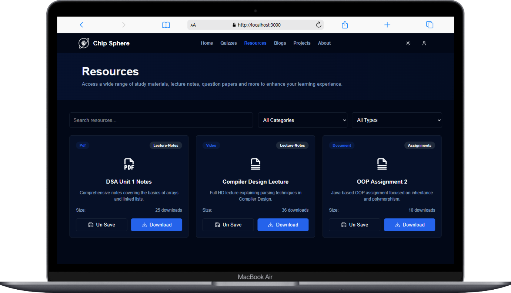
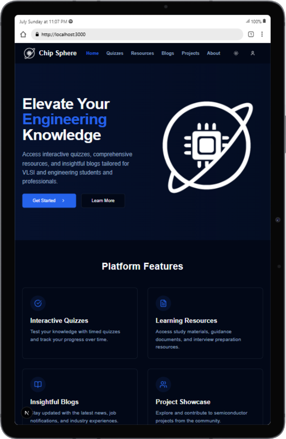
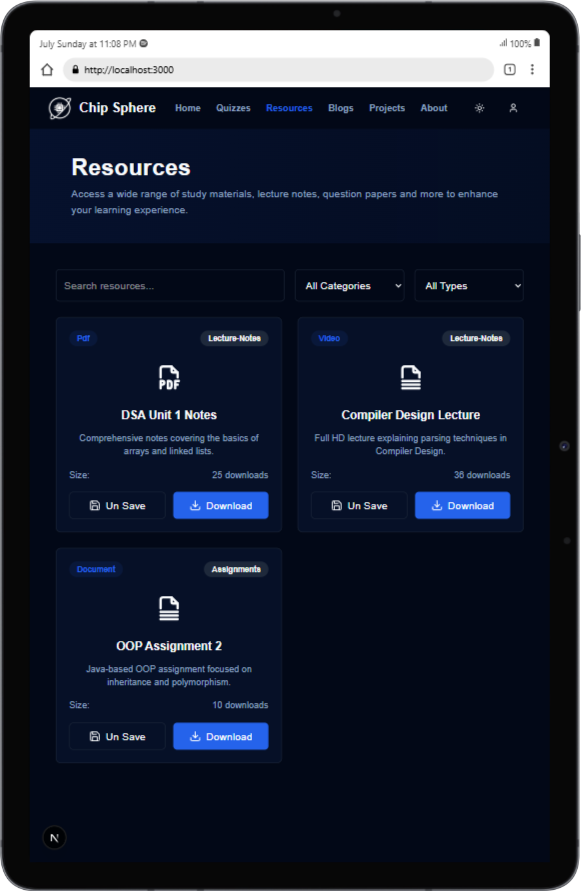

# Project Name: **Chip Sphere**

This project visualizes and analyzes various chip data metrics through interactive dashboards. It fetches data from a backend API and displays it using charts and key insights, enabling users to easily track and interpret chip-level statistics.

## 🔗 Live Demo

[Click here to view the live project](https://chip-sphere.vercel.app/)

---

## Table of Contents

1. [Project Setup](#project-setup)  
2. [Frontend Installation](#frontend-installation)  
3. [Backend Installation](#backend-installation)  
4. [Running the Project](#running-the-project)  
5. [Technologies Used](#technologies-used)  
6. [Device Screenshots](#device-screenshots)

---

## Project Setup

Before you begin, ensure you have the following installed for both the **frontend** and **backend**:

- **Node.js**: [Download Node.js](https://nodejs.org/)  
- **npm** (comes with Node.js): For managing dependencies.  
- **MongoDB** (for database)

---

## Frontend Installation

1. **Clone the repository:**

    ```bash
    git clone https://github.com/sanketyelugotla/Chip-Sphere.git
    cd Frontend
    ```

2. **Install dependencies:**

    ```bash
    npm install
    ```

3. **Start the development server:**

    ```bash
    npm run dev
    ```

4. Open the app in your browser at [http://localhost:5173](http://localhost:5173)

    - The project should automatically open in your default browser.  
    - If not, open [http://localhost:5173](http://localhost:5173) manually.

---

## Backend Installation

1. **Navigate to the backend folder:**

    ```bash
    cd ../Backend
    ```

2. **Install dependencies:**

    ```bash
    npm install
    ```

3. **Set up the database:**

    - Make sure MongoDB is running locally or use [MongoDB Atlas](https://www.mongodb.com/cloud/atlas)
    - Confirm the connection string is set correctly.

4. **Create a `.env` file:**

    ```env
    MONGO_URL=<your-mongodb-connection-string>
    PORT=5000
    ```

    - Replace `<your-mongodb-connection-string>` with your actual MongoDB URI.

5. **Start the backend server:**

    ```bash
    npm run dev
    ```

    This starts the server at [http://localhost:5000](http://localhost:5000)

---

## Running the Project

Once both the **frontend** and **backend** are up:

- Frontend: [http://localhost:5173](http://localhost:5173)  
- Backend: [http://localhost:5000](http://localhost:5000)

The frontend communicates with the backend to fetch and visualize chip metrics.

---

## Technologies Used

### Frontend

- **Next.js**: React framework for server-side rendering and static site generation  
- **Tailwind CSS / Material UI**: For responsive UI components  
- **Axios**: To handle HTTP requests  

### Backend

- **Node.js**: Runtime environment  
- **Express.js**: Backend routing and middleware  
- **MongoDB / Mongoose**: NoSQL database   

---

## Device Screenshots

### Mobile Phones

|  |  |  |  |
| ------------------------------------------- | ------------------------------------------- | ------------------------------------------- | ------------------------------------------- |

### Laptops

|       |       |       |       |
| ------------------------------------------ | ------------------------------------------ | ------------------------------------------ | ------------------------------------------ |

### Tablets

|       |       |       |       |
| ------------------------------------------ | ------------------------------------------ | ------------------------------------------ | ------------------------------------------ |

